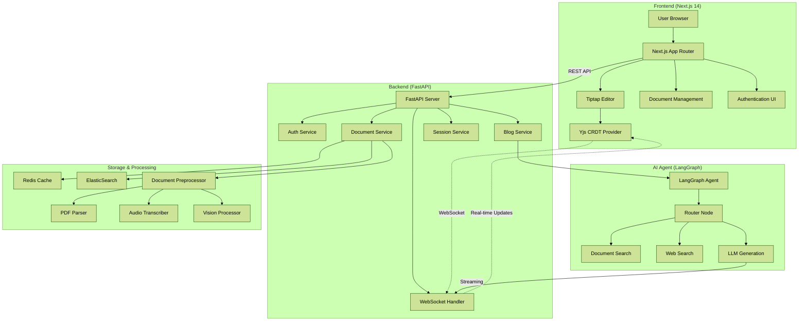

# 📝 Blog Creator Agent

**RAG-powered system: documents → blog posts with AI assistance**

Next.js 14 + FastAPI with Redis and Elasticsearch.

## 🎯 Project Purpose

This project implements a **document-centric collaborative editing solution** using modern web technologies. Chat-based UIs are sub-optimal for iterating on document updates because they require users to describe changes conversationally, making it difficult to:

- See and edit content in real-time
- Collaborate with multiple users simultaneously
- Make precise edits with visual feedback
- Maintain document structure and formatting

This project implements a **document-centric collaborative editing solution** using modern web technologies that enable real-time, multi-user document collaboration.

## ✨ Key Features

* **RAG-based Content Generation**: Generates accurate blog drafts from PDF, audio, and image documents using LangChain and LangGraph
* **Real-time Collaborative Editing**: Multi-user document editing with conflict-free synchronization (Yjs CRDT)
* **Rich Text Editor**: Tiptap-based editor with full formatting capabilities
* **Dynamic Tool Usage**: Combines local documents and web search (Tavily) for enhanced content
* **Document Processing**: Supports PDF, audio (transcription), and image (vision) processing
* **Automatic Publishing**: Converts content to Jekyll format and publishes to GitHub Pages
* **WebSocket Communication**: Real-time bidirectional updates between frontend and backend

## 🏗️ Architecture



**Architecture Highlights:**
- **Frontend**: Next.js 14 with TypeScript, Tailwind CSS, and Tiptap editor
- **Backend**: FastAPI with async support, WebSocket, and REST APIs
- **AI Agent**: LangGraph-based RAG pipeline with OpenAI
- **Storage**: Redis (sessions/cache), Elasticsearch (document search with Nori Korean tokenizer)
- **Collaboration**: Yjs CRDT for conflict-free real-time editing

## 🚀 Quick Start

### Prerequisites

* Python 3.11+ (used: 3.11.14)
* Node.js 18+
* [uv](https://github.com/astral-sh/uv) (Python dependency management)
* Docker (for Redis/ElasticSearch)

### Installation

1. **Clone Repository**
   ```bash
   git clone https://github.com/Wchoi189/blog-creator-agent.git
   cd blog-creator-agent
   ```

2. **Install uv** (if not already installed)
   ```bash
   # macOS/Linux
   curl -LsSf https://astral.sh/uv/install.sh | sh
   
   # Windows (PowerShell)
   powershell -ExecutionPolicy ByPass -c "irm https://astral.sh/uv/install.ps1 | iex"
   ```

3. **Backend Setup**
   ```bash
   # Create virtual environment and install dependencies
   uv sync
   
   # Activate virtual environment
   source .venv/bin/activate  # Linux/macOS
   # or
   .venv\Scripts\activate     # Windows
   
   # Copy environment file
   cp .env.example .env
   # Add your API keys (OpenAI, Tavily, etc.)
   
   # Run backend
   uv run python -m backend.main
   # or
   python -m backend.main
   ```
   Backend runs on `http://localhost:8000`

3. **Frontend Setup**
   ```bash
   cd frontend
   npm install
   cp .env.local.example .env.local
   # Configure API endpoint
   npm run dev
   ```
   Frontend runs on `http://localhost:3000`

4. **Start Redis (Optional)**
   ```bash
   docker run -d --name redis-stack -p 6379:6379 redis/redis-stack:latest
   ```

For detailed setup instructions, see [Installation Guide](docs/1_INSTALLATION.md).

## 🔨 Tech Stack

### Frontend
* **Framework**: Next.js 14 (App Router)
* **Language**: TypeScript
* **Styling**: Tailwind CSS
* **Editor**: Tiptap (ProseMirror-based)
* **Collaboration**: Yjs CRDT
* **State Management**: Zustand
* **HTTP Client**: Axios

### Backend
* **Framework**: FastAPI
* **Language**: Python 3.11+
* **Dependency Manager**: uv
* **AI/ML**: LangChain, LangGraph, OpenAI, Ollama
* **API Docs**: OpenAPI/Swagger (auto-generated)
* **WebSocket**: Native FastAPI WebSocket support
* **Authentication**: JWT tokens + API keys

### Storage & Infrastructure
* **Sessions/Cache**: Redis
* **Document Search**: Elasticsearch (with Nori Korean tokenizer)
* **Web Search**: Tavily API
* **Dev Tools**: uv, Ruff, pre-commit

## 📁 Project Structure

```
blog-creator-agent/
├── backend/                 # FastAPI backend
│   ├── main.py             # Application entry point
│   ├── api/v1/             # REST API endpoints
│   │   ├── auth.py         # Authentication
│   │   ├── documents.py    # Document management
│   │   ├── blog.py         # Blog generation
│   │   ├── sessions.py     # Session management
│   │   └── websocket.py   # WebSocket handler
│   ├── services/           # Business logic
│   ├── models/             # Pydantic models
│   ├── core/               # Security, database utilities
│   └── agent/              # LangGraph agent (from src/)
│
├── frontend/                # Next.js frontend
│   ├── src/
│   │   ├── app/            # Pages (App Router)
│   │   │   ├── (auth)/     # Login, register
│   │   │   └── (dashboard)/ # Protected pages
│   │   ├── components/     # React components
│   │   │   ├── editor/     # Tiptap editor
│   │   │   └── layout/     # Navbar, Sidebar
│   │   ├── lib/            # API client, utilities
│   │   ├── hooks/          # Custom React hooks
│   │   ├── store/          # Zustand state management
│   │   └── types/          # TypeScript types
│   └── package.json
│
├── docs/                    # Documentation
│   ├── plans/              # Implementation roadmap
│   └── ...
│
└── configs/                 # Configuration files
```

## 📊 Project Roadmap & Progress

### Current Status: ~70% Complete

| Phase | Status | Progress | Description |
|-------|--------|----------|-------------|
| **Part 1: Backend** | ✅ Complete | 100% | FastAPI with 20+ endpoints, WebSocket, authentication |
| **Part 2: Frontend** | 🔄 In Progress | 85% | Next.js UI, editor, document management |
| **Part 3: Advanced** | ⏸️ Pending | 0% | Yjs CRDT, GitHub publishing |
| **Part 4: Deployment** | ⏸️ Pending | 0% | Docker, CI/CD, monitoring |

### Completed Features

✅ **Backend (100%)**
- FastAPI REST API with 20+ endpoints
- JWT + API key authentication
- Document processing (PDF, audio, images)
- LangGraph agent integration with streaming
- WebSocket real-time communication
- Session management
- Redis + Elasticsearch integration

✅ **Frontend (85%)**
- Next.js 14 with TypeScript + Tailwind
- Authentication (login/register)
- Dashboard with stats and quick actions
- Document upload with drag-and-drop
- Document management table
- Tiptap rich text editor
- Settings with API key management
- Responsive navigation
- Type-safe API client

### Upcoming Features

🔄 **Part 2 Remaining (15%)**
- Blog drafts listing page
- Blog generation flow (select documents → generate)
- WebSocket integration for real-time status
- Streaming LLM responses in editor

⏸️ **Part 3: Advanced Features**
- Yjs CRDT for collaborative editing
- GitHub OAuth integration
- Jekyll format conversion
- Automated GitHub publishing

⏸️ **Part 4: Production Deployment**
- Docker containers (backend + frontend)
- Docker Compose setup
- CI/CD pipeline (GitHub Actions)
- Monitoring and logging (Prometheus, Grafana)

**Estimated Time Remaining**: ~10-14 hours

For detailed progress tracking, see [docs/plans/README.md](docs/plans/README.md).

## 📚 Documentation

* [Installation Guide](docs/1_INSTALLATION.md) - Detailed setup instructions
* [Usage Guide](docs/2_USAGE_GUIDE.md) - How to use the application
* [Architecture](docs/3_ARCHITECTURE.md) - System architecture details
* [Customization](docs/4_CUSTOMIZATION.md) - Configuration options
* [Implementation Plans](docs/plans/README.md) - Migration roadmap and progress
* [Handover Document](HANDOVER.md) - Session handover notes

## 🤝 Contributing

Contributions are welcome! Please refer to the [Contributing Guide](docs/5_CONTRIBUTING.md) for development standards and workflow.

## 📄 License

This project is distributed under the MIT License.
