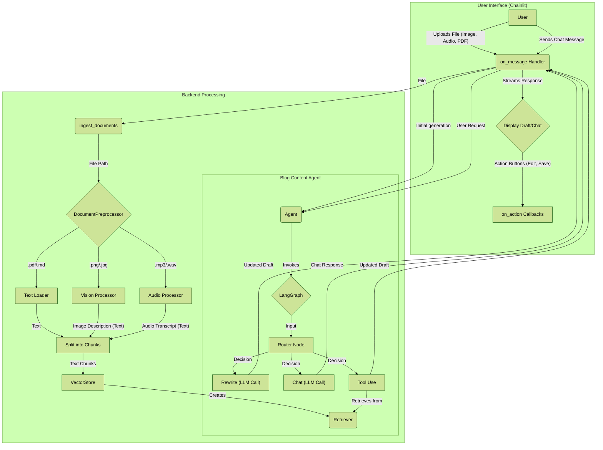

# 📝 Blog Content Creator Agent (Refactored: Chainlit UI Applied)

**A LangChain-based automation system that automatically converts various source documents (PDF, audio, images) into high-quality blog posts and publishes them to GitHub Pages.**

This project is based on the `RAG` (Retrieval-Augmented Generation) pipeline, understands and summarizes the content of user-provided documents to generate blog drafts. It also uses web search tools to enhance content with the latest information and allows real-time modification requests through a fully interactive interface.

## ✨ Key Features

  * **RAG-based Content Generation**: Generates accurate and consistent blog drafts based on `PDF, audio, image` document content.
  * **Dynamic Tool Usage**: Dynamically combines local documents and web information using `document_search` and `tavily_search` tools.
  * **Configurable Architecture**: Flexibly change LLM, embedding models, and data processing methods through `config.yaml`.
  * **Interactive Editing**: Chat with the AI agent through Chainlit-based UI to modify and improve content in real-time.
  * **Automatic Publishing**: Converts completed content to Jekyll format and automatically publishes to GitHub Pages repository.

## 🎨 Key Features Demo

**🎞 Chainlit Demo Screenshots**

_Below are screen examples showing the Chainlit UI and main features._

<p align="center"><a href="docs/assets/chainlit demo/chainlit_home.png"></a></p>

<p align="center"><em>Chainlit home screen where you can select models and providers.</em></p>

<p align="center"><a href="docs/assets/chainlit demo/chainlit-demo-select-model-modal.png"></a></p>

<p align="center"><em>Example modal screen for selecting a model.</em></p>

<p align="center"><a href="docs/assets/chainlit demo/chainlit-home-select-provider.png"></a></p>

<p align="center"><em>Chainlit UI screen for selecting a model provider.</em></p>

<p align="center"><a href="docs/assets/chainlit demo/chainlit-blog-generation-demo.png"></a></p>

<p align="center"><em>Screen showing the output and options of the blog generation demo.</em></p>

<p align="center"><a href="docs/assets/chainlit demo/test_audio_terminal_output1.png"></a></p>

<p align="center"><em>Example of outputting audio file content.</em></p>

<p align="center"><a href="docs/assets/chainlit demo/test_audio_terminal_output2.png"></a></p>

<p align="center"><a href="docs/assets/chainlit demo/test_vision_terminal_output.png"></a></p>

<p align="center"><em>Example of extracting meaning from a single PDF image page.</em></p>

## 🚀 Quick Start

### **Prerequisites**

  * Python 3.11+
  * Poetry
  * Docker
  * **GitHub Pages Setup Complete**: GitHub Pages repository must be pre-configured for blog publishing.

### Project Flow Diagram



**Diagram Explanation:**

  * **Ingestion Layer**: Shows the process where user's uploaded documents are converted to text, vectorized through embedding models, and stored in the vector database.
  * **Generation Layer**: Shows the process where the AI agent uses the vector database and web search tools to generate blog drafts. Modifications and improvements are made through conversation with the user.
  * **Overall Flow**: Designed to provide an overview of the entire process from user input to content generation, editing, and final publishing to `GitHub Pages`.

### **Installation and Execution**

1.  **Clone Repository**
    ```bash
    git clone https://github.com/AIBootcamp13/upstageailab-langchain-pjt-langchain_8.git
    cd upstageailab-langchain-pjt-langchain_8
    ```
2.  **Install Dependencies**
    ```bash
    poetry install
    ```
3.  **Set Environment Variables**
    ```bash
    cp .env.template .env
    # Enter OpenAI, Tavily API keys in .env file
    ```
4.  **Run Backend Service (Redis)**
    ```bash
    # Run Redis for caching using Docker
    docker run -d --name redis-stack -p 6379:6379 -p 8001:8001 redis/redis-stack:latest
    ```
5.  **Run Application**
    ```bash
    poetry run chainlit run src/chainlit_app.py -w
    ```

For more details, refer to the [Installation Guide](docs/1_INSTALLATION.md).

## 🔨 Tech Stack

  * **Language**: Python 3.11
  * **Frontend**: Chainlit
  * **AI/ML**: LangChain, LangGraph, OpenAI, Ollama
  * **Vector DB**: ChromaDB
  * **Caching DB**: Redis
  * **Search**: Tavily API
  * **Dev Tools**: Poetry, Ruff, pre-commit, Git/GitHub

## 📚 Detailed Documentation (Table of Contents)

  * [Theme Blog Setup Guide](https://github.com/Wchoi189/blog-creator-agent/blob/main/docs/0_BLOG_SETUP_CHIRPY.md)
  * [Installation Guide](https://github.com/Wchoi189/blog-creator-agent/blob/main/docs/1_INSTALLATION.md)
  * [Usage Guide](https://github.com/Wchoi189/blog-creator-agent/blob/main/docs/2_USAGE_GUIDE.md)
  * [System Architecture](https://github.com/Wchoi189/blog-creator-agent/blob/main/docs/3_ARCHITECTURE.md)
  * [Configuration and Customization](https://github.com/Wchoi189/blog-creator-agent/blob/main/docs/4_CUSTOMIZATION.md)
  * [Contributing](https://github.com/Wchoi189/blog-creator-agent/blob/main/docs/5_CONTRIBUTING.md)
  * [Troubleshooting Guide](https://github.com/Wchoi189/blog-creator-agent/blob/main/docs/6_TROUBLESHOOTING.md)

## 📁 Project Structure

```
.
├── configs/                # Configuration files (config.yaml)
├── data/                   # Data directory (ChromaDB persistent storage)
├── docs/                   # Documents and guides
├── logs/                   # Log storage
├── notebooks/              # Experimental Jupyter notebooks
├── prompts/                # Prompt management (prompts.yaml)
├── public/                 # Chainlit UI custom assets (CSS, JS)
├── src/                    # Source code
│   ├── agent.py            # BlogContentAgent class
│   ├── caching.py          # Redis caching configuration
│   ├── chainlit_app.py     # Chainlit UI entry point
│   ├── config.py           # Central configuration logic
│   ├── document_preprocessor.py # PDF, image, audio processing
│   ├── graph.py            # LangGraph state machine definition
│   ├── retriever.py        # RetrieverFactory
│   ├── vector_store.py     # Vector DB (ChromaDB) wrapper
│   ├── audio_processor.py  # Audio-to-text conversion logic
│   ├── vision_processor.py # Image-to-text conversion logic
│   └── ui/                 # Chainlit UI modules
│       └── chainlit/       # Callbacks, handlers, settings
└── ...
```

## 🤝 Contributing

Want to contribute to this project? Please refer to the [Contributing Guide](docs/5_CONTRIBUTING.md) to help develop the project together. All contributions are welcome!

## **👥 Team Members**

## 📄 License

This project is distributed under the MIT License.